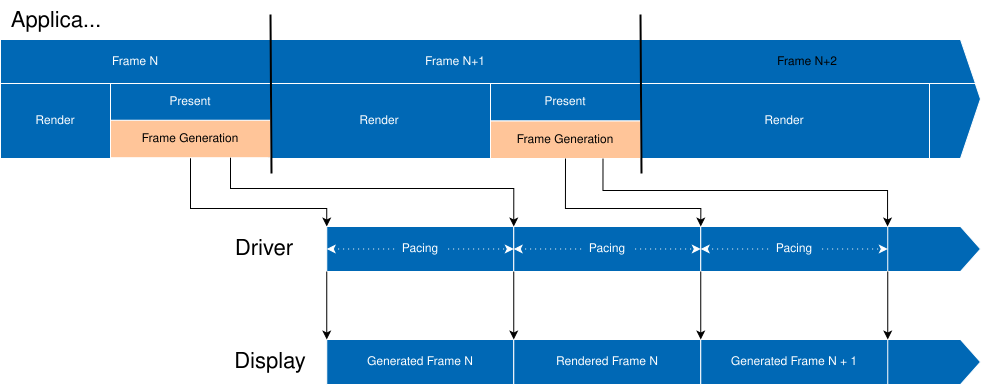
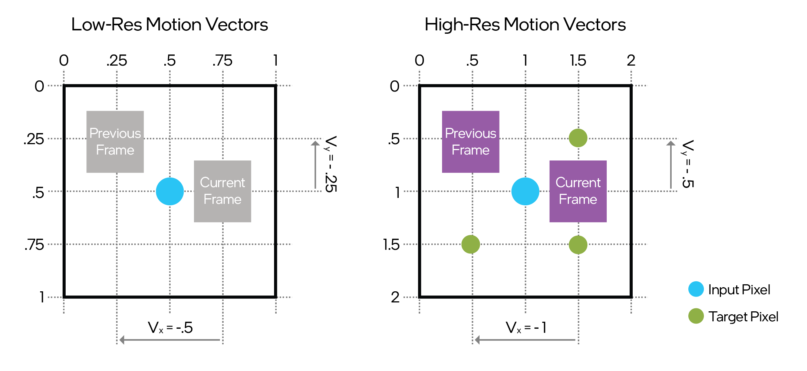
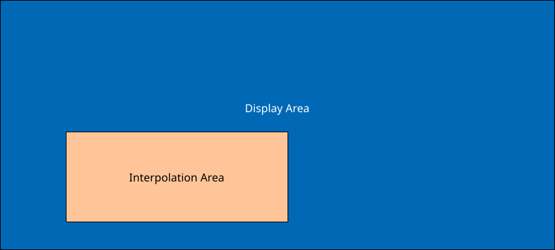

# Intel® XeSS Frame Generation (XeSS-FG) Developer Guide 1.3

Intel® XeSS Frame Generation (XeSS-FG) is an AI-based frame interpolation technology.
XeSS-FG uses deep learning to generate detailed, high-resolution frames,
improving gaming performance and fluidity without degrading image quality.

This document provides a guide for developers on how to integrate XeSS-FG into their applications.

Contents:

- [Introduction](#introduction)
- [Requirements](#requirements)
- [Deployment](#deployment)
- [Naming Conventions and Branding Guidance](#naming-conventions-and-branding-guidance)
- [Quick Start Guide](#quick-start-guide)
- [Programming Guide](#programming-guide)
  - [Context Creation](#context-creation)
  - [Logging Callback](#logging-callback)
  - [Connect with XeLL](#connect-with-xell)
  - [Initialization](#initialization)
    - [Initialization Flags](#initialization-flags)
    - [External Memory Heap](#external-memory-heap)
    - [Controlling the Number of Generated Frames](#controlling-the-number-of-generated-frames)
  - [UI Handling](#ui-handling)
    - [Recommendations for UI Handling](#recommendations-for-ui-handling)
    - [UI Interpolation](#ui-interpolation)
    - [UI Composition Modes](#ui-composition-modes)
      - [UI Composition Modes Comparison Table](#ui-composition-modes-comparison-table)
  - [HDR Display Support](#hdr-display-support)
  - [Enabling Frame Generation](#enabling-frame-generation)
  - [Inputs](#inputs)
    - [Resource Tagging](#resource-tagging)
    - [Motion Vectors](#motion-vectors)
    - [Depth](#depth)
    - [HUD-less Color Texture](#hud-less-color-texture)
    - [UI Texture](#ui-texture)
  - [Frame Constants](#frame-constants)
  - [Descriptor Heap](#descriptor-heap)
  - [Letterboxing](#letterboxing)
  - [Asynchronous Shader Compilation](#asynchronous-shader-compilation)
  - [Execution](#execution)
    - [Present Status](#present-status)
    - [Changing Window State and Swap Chain Resolution](#changing-window-state-and-swap-chain-resolution)
  - [Shutdown](#shutdown)
  - [Multithreading](#multithreading)
  - [Error Handling](#error-handling)
  - [Implementation Details](#implementation-details)
  - [Compatibility with Third-Party Frame Generation Software](#compatibility-with-third-party-frame-generation-software)
  - [Debug Features](#debug-features)
  - [Compatibility with Performance Analysis and Debugging Tools](#compatibility-with-performance-analysis-and-debugging-tools)
  - [Capturing Diagnostic Information](#capturing-diagnostic-information)
  - [Interaction with Intel Graphics Software](#interaction-with-intel-graphics-software)
  - [Versioning](#versioning)
- [Notices](#notices)

## Introduction

Intel® XeSS Frame Generation (XeSS-FG) is implemented as a sequence of compute shader passes,
executed before a presentation event to generate additional frames. XeSS-FG provides
a proxy swap chain to simplify integration, abstracting the complexity of issuing several
present calls for every application-rendered frame with smooth presentation pacing.
Intel® XeSS-FG can be combined with other technologies to deliver the best experience on
both integrated and discrete graphics platforms. For optimal performance, we recommend the following
frame rate targets:

- **40 FPS minimum (XeSS-SR or native input specification):** This provides adequate reconstruction
  for fluid gameplay, making it ideal for entry-level graphics.
- **60 FPS recommended (XeSS-SR or native input specification):** This ensures the best latency
  experience with the most fluid gameplay, targeting high-end graphics.

XeSS-FG supports all vertical synchronization (VSYNC) and refresh rate modes (fixed refresh rate and variable refresh rate -
VRR). For best results, motion blur should be either disabled or modified to accommodate the
additional frames produced by XeSS-FG.

## Requirements

- Windows 10/11 x64 - 10.0.19043/22000 or later
- DirectX 12
  - Intel GPU with driver version 32.0.101.7029 or later:
    - Intel Arc™ Graphics family (Codename Alchemist, Battlemage)
    - Intel Core™ Ultra processor family (Codename Meteor Lake, Lunar Lake, Arrow Lake-S, Arrow Lake-H, Panther Lake)
  - or any non-Intel GPU supporting Shader Model 6.4
- [Intel® Xe Low Latency (XeLL)](#connect-with-xell) 1.3.0 or later
- Microsoft Visual C++ Redistributable 14.40.33810 or later

> [!IMPORTANT]
> On non-Intel GPUs the maximum number of generated frames is one.

> [!IMPORTANT]
> Latency reduction solutions other than XeLL are not supported and may cause unexpected behavior.

## Deployment

To use XeSS-FG in a project:

- Add `inc` folder to the include path
- Include `xefg_swapchain.h`, `xefg_swapchain_d3d12.h`, and `xefg_swapchain_debug.h`
- Link with `lib/libxess_fg.lib`

The following file must be placed next to the executable or in the DLL search path:

- `libxess_fg.dll`

Microsoft Visual C++ Redistributable 14.40.33810 or later must be installed or bundled with the application. The following libraries are required:

- `msvcp140.dll`
- `vcruntime140.dll`
- `vcruntime140_1.dll`

## Naming Conventions and Branding Guidance

Please see ["XeSS 3 Naming Structure and Examples"](xess_naming_structure_and_examples_english.md)
for approved naming conventions, branding guidance, and settings menu examples.

## Quick Start Guide

- Create XeSS-FG context.
  - Can be done at application start.
  - `xefgSwapChainD3D12CreateContext`
- Register logging callback.
  - `xefgSwapChainSetLoggingCallback`
- Provide XeLL context.
  - `xefgSwapChainSetLatencyReduction`
- Initialize proxy swap chain.
  - `xefgSwapChainD3D12GetProperties`
  - `xefgSwapChainD3D12InitFromSwapChain` or `xefgSwapChainD3D12InitFromSwapChainDesc`
- Use XeSS-FG proxy swap chain instead of the native swap chain.
  - `xefgSwapChainD3D12GetSwapChainPtr`
- Enable frame generation
  - UI composition is disabled by default (UI is interpolated). See [UI Handling](#ui-handling), if you need to customize UI handling.
  - `xefgSwapChainSetEnabled`
- Turn off or reduce motion blur when XeSS-FG is enabled.
- For each frame:
  - Tag resources.
    - `xefgSwapChainD3D12TagFrameResource`
      - Required `XEFG_SWAPCHAIN_RES_MOTION_VECTOR`
      - Required `XEFG_SWAPCHAIN_RES_DEPTH`
    - `xefgSwapChainTagFrameConstants`
  - Present.
    - Call `xefgSwapChainSetPresentId` before `Present`/`Present1`.
- Pause XeSS-FG.
  - `xefgSwapChainSetEnabled`
- Destroy the XeSS-FG context and the proxy swap chain.
  - `xefgSwapChainDestroy`

## Programming Guide

XeSS-FG API provides an implementation of `IDXGISwapChain4` interface that applications can use
instead of the native DXGI swap chain. This proxy swap chain produces additional frames and paces
presentation to ensure that generated and application-rendered frames appear on the screen at the right time.
On Intel® GPUs, the pacing is performed by the Intel® Graphics Driver. On GPUs from other vendors,
the pacing is handled by a high-priority background thread that submits presents to an internally-managed
high-priority direct queue.

> [!IMPORTANT]
> Frame generation delays presentation of the application frames, making XeLL integration critical for reducing latency.



*Figure 1. Library interaction with application's pipeline on Intel GPUs.*

Generally, XeSS-FG integration is a straightforward process, especially when accompanied by
[XeSS Inspector](https://www.intel.com/content/www/us/en/developer/articles/technical/intel-xess-inspector.html).
Make sure that the application can provide the [required inputs](#inputs) before proceeding with [context creation](#context-creation).

> [!IMPORTANT]
> If your application is using `GetLastPresentCount` or `GetFrameStatistics`, consult
> the [Implementation Details](#implementation-details) section to understand how these features interact with XeSS-FG.

### Context Creation

The first step is creating an XeSS-FG context:

```cpp
xefg_swapchain_handle_t xefgContext = nullptr;
xefg_swapchain_result_t result = xefgSwapChainD3D12CreateContext(pD3D12Device, &xefgContext);
if (result != XEFG_SWAPCHAIN_RESULT_SUCCESS)
{
    Log("XeSS-FG is not supported on this device: %d", result);
    return;
}
```

The function `xefgSwapChainD3D12CreateContext` will check if the device has the necessary feature capabilities
to support XeSS-FG. If the device's feature level is too low, the function will fail.
On Intel GPUs the function also ensures that all required extensions are present and redirects the API
calls to a newer driver version of XeSS-FG if available.

Context creation typically takes 10-50ms and uses the minimum amount of resources necessary to ensure that
subsequent proxy swap chain initialization goes smoothly.

> [!NOTE]
> Use `xefgSwapChainD3D12CreateContext` to check if XeSS-FG is supported.
> After this you can either keep the context around or delete it using `xefgSwapChainDestroy`.

### Logging Callback

Once a context is created, the application can obtain additional diagnostic information by
registering a logging callback:

```cpp
static void logCallback(const char* message, xefg_swapchain_logging_level_t level, void* userData);

xefg_swapchain_logging_level_t logLevel = XEFG_SWAPCHAIN_LOGGING_LEVEL_WARNING;

xefgSwapChainSetLoggingCallback(xefgContext, logLevel, logCallback, userData);
```

The logging supports four verbosity levels:

- `XEFG_SWAPCHAIN_LOGGING_LEVEL_DEBUG`
- `XEFG_SWAPCHAIN_LOGGING_LEVEL_INFO`
- `XEFG_SWAPCHAIN_LOGGING_LEVEL_WARNING`
- `XEFG_SWAPCHAIN_LOGGING_LEVEL_ERROR`

Use `XEFG_SWAPCHAIN_LOGGING_LEVEL_ERROR` for production and `XEFG_SWAPCHAIN_LOGGING_LEVEL_DEBUG` during development.

### Connect with XeLL

XeSS-FG requires a working XeLL integration on all GPUs. Please follow the [XeLL Developer
Guide](xell_developer_guide_english.md) to integrate XeLL.

Once XeLL and XeSS-FG contexts have been created, call `xefgSwapChainSetLatencyReduction` to connect them:

```cpp
xefgSwapChainSetLatencyReduction(xefgContext, xellContext);
```

> [!IMPORTANT]
> XeSS-FG proxy swap chain will fail to initialize without XeLL context.
> Frame generation will be disabled if XeLL is not initialized and enabled.

> [!IMPORTANT]
> Latency reduction solutions other than XeLL are not supported.
> Enabling them while using XeSS-FG may lead to unexpected behavior.

The application can disable XeLL when frame generation is disabled, but XeLL must be enabled before enabling frame
generation.

The application must use the same frame ID value for XeLL markers and the XeSS-FG present ID:

```cpp
// Frame counter to be used as frame/present ID in XeLL and XeSS-FG.
// We'll increment it after each call to `Present`.
// Initial value does not matter.
uint32_t frameCounter = 0;

// ...

xellAddMarkerData(xellContext, frameCounter, XELL_PRESENT_START);
xefgSwapChainSetPresentId(xefgContext, frameCounter);

swapChain->Present(0, DXGI_PRESENT_ALLOW_TEARING);

xellAddMarkerData(xellContext, frameCounter, XELL_PRESENT_END);

++frameCounter;
```

Make sure that the XeLL context is available for the entire lifetime of the XeSS-FG context.

> [!IMPORTANT]
> XeLL context must be destroyed after XeSS-FG context.

### Initialization

There are two ways to initialize XeSS-FG proxy swap chain:

- Initialization from an existing swap chain using `xefgSwapChainD3D12InitFromSwapChain`
  - Queries parameters from the provided swap chain.
  - The application must provide a swap chain pointer with reference counter equal to `1`.
  - **The application-provided swap chain will be released!** The function will fail to re-create
    the native swap chain if there are other outstanding references to application swap chain.
  - After successful call, the provided swap chain pointer will be invalid.
  - Creates a new swap chain for the underlying window.
  - Returns error in exclusive fullscreen mode.

  ```cpp
  ComPtr<IDXGISwapChain4> swapChain = CreateApplicationSwapChain();

  xefg_swapchain_d3d12_init_params_t initParams = {};
  initParams.pApplicationSwapChain = swapChain.Detach();  // transfer ownership
  initParams.maxInterpolatedFrames = XEFG_SWAPCHAIN_USE_MAX_SUPPORTED_INTERPOLATED_FRAMES;

  xefgSwapChainD3D12InitFromSwapChain(xefgContext, commandQueue.Get(), &initParams);
  ```

- Initialization from a swap chain description using `xefgSwapChainD3D12InitFromSwapChainDesc`
  - Creates new swap chain for the provided window.
  - The application should not have any swap chains associated with the provided window.
  - Won't fail in exclusive fullscreen mode but frame generation can't be enabled.

  ```cpp
  xefg_swapchain_d3d12_init_params_t initParams = {};
  initParams.maxInterpolatedFrames = XEFG_SWAPCHAIN_USE_MAX_SUPPORTED_INTERPOLATED_FRAMES;

  xefgSwapChainD3D12InitFromSwapChainDesc(
    xefgContext, hwnd, &swapChainDesc, &fullscreenDesc, commandQueue.Get(), dxgiFactory.Get(), &initParams);

  ComPtr<IDXGISwapChain4> swapChain;
  xefgSwapChainD3D12GetSwapChainPtr(xefgContext, IID_PPV_ARGS(&swapChain));
  ```

> [!NOTE]
> XeSS-FG does not support fullscreen exclusive mode. Initialization from an existing swap chain will fail;
> initialization from a description will succeed but frame generation cannot be enabled.

If initialization from the application swap chain fails, you can validate the number of outstanding references to the application swap chain as follows:

```cpp
// Increase reference count by one.
const ULONG referenceCountPlusOne = swapChain->AddRef();
// Restore the reference count.
swapChain->Release();

if (referenceCountPlusOne > 2U)
{
    Log("There are additional outstanding references to the swap chain");
}
```

See [Rules for Managing Reference Counts](https://learn.microsoft.com/en-us/windows/win32/com/rules-for-managing-reference-counts)
for additional tips on working with COM objects.

Once XeSS-FG is initialized the application must obtain a pointer to the proxy swap chain:

```cpp
ComPtr<IDXGISwapChain4> swapChain;
xefgSwapChainD3D12GetSwapChainPtr(xefgContext, IID_PPV_ARGS(&swapChain));
```

> [!IMPORTANT]
> From this point on, all interaction with the swap chain must be done via the proxy swap chain pointer.

XeSS-FG stores a reference to the command queue provided during initialization and executes the
interpolation work using this queue. The application must ensure that the lifetime of the command queue
exceeds the lifetime of the XeSS-FG swap chain.

> [!NOTE]
> Please note that XeSS-FG is disabled by default and can be enabled by calling `xefgSwapChainSetEnabled`.
> See [Enabling Frame Generation](#enabling-frame-generation) for more details.

The application can also optionally provide an external descriptor heap, which XeSS-FG will use for internal resource descriptors.
In this case, the application must set `XEFG_SWAPCHAIN_INIT_FLAG_EXTERNAL_DESCRIPTOR_HEAP` flag
during initialization and pass the descriptor heap and the offset by calling `xefgSwapChainD3D12SetDescriptorHeap`.
The required amount of descriptors can be obtained by calling `xefgSwapChainD3D12GetProperties`.
The descriptor heap must have type `D3D12_DESCRIPTOR_HEAP_TYPE_CBV_SRV_UAV` and be shader-visible.

> [!IMPORTANT]
> Currently XeSS-FG does not support multiple proxy swap chains operating at the same time.

#### Initialization Flags

The application can use initialization flags to customize XeSS-FG behavior:

- `XEFG_SWAPCHAIN_INIT_FLAG_NONE` – default
- `XEFG_SWAPCHAIN_INIT_FLAG_INVERTED_DEPTH` – depth texture uses inverted values
- `XEFG_SWAPCHAIN_INIT_FLAG_EXTERNAL_DESCRIPTOR_HEAP` – use application-provided external
  descriptor heap
- `XEFG_SWAPCHAIN_INIT_FLAG_HIGH_RES_MV` – high-res motion vectors texture (swap chain resolution)
- `XEFG_SWAPCHAIN_INIT_FLAG_USE_NDC_VELOCITY` – motion vectors use NDC
- `XEFG_SWAPCHAIN_INIT_FLAG_JITTERED_MV` – motion vectors are not un-jittered
- `XEFG_SWAPCHAIN_INIT_FLAG_UITEXTURE_NOT_PREMUL_ALPHA` – RGB values in the UI texture are not
  pre-multiplied by the corresponding alpha value from the alpha channel

#### External Memory Heap

By default, XeSS-FG manages its own GPU memory. Applications that need fine-grained control over GPU memory allocation can optionally provide external heaps.

XeSS-FG allocates GPU memory for three major resource categories:

- resources for model execution
- proxy back buffers
- input history

The application can share (alias) GPU memory by providing external memory heaps for buffers and textures
used during the model execution. To do this, query the required sizes with `xefgSwapChainD3D12GetProperties`
and pass heap pointers and offsets via the initialization parameters:

```cpp
// Fill initialization parameters that affect outputs
xefg_swapchain_d3d12_init_params_t initParams = {};
initParams.maxInterpolatedFrames = 3;
initParams.initFlags = XEFG_SWAPCHAIN_INIT_FLAG_INVERTED_DEPTH;
initParams.uiMode = XEFG_SWAPCHAIN_UI_MODE_AUTO;

xefg_swapchain_properties_t props = {};
xefgSwapChainD3D12GetProperties(
  xefgContext, &initParams, backBufferWidth, backBufferHeight, backBufferFormat, &props);

ComPtr<ID3D12Heap> bufferHeap = AllocateBufferHeap(
  props.tempBufferHeapSize, D3D12_DEFAULT_RESOURCE_PLACEMENT_ALIGNMENT);
ComPtr<ID3D12Heap> textureHeap = AllocateTextureHeap(
  props.tempTextureHeapSize, D3D12_DEFAULT_RESOURCE_PLACEMENT_ALIGNMENT);

// Fill remaining initialization parameters
initParams.pTempBufferHeap = bufferHeap.Get();
initParams.pTempTextureHeap = textureHeap.Get();
initParams.pApplicationSwapChain = swapChain.Detach();  // transfer ownership

xefgSwapChainD3D12InitFromSwapChain(xefgContext, commandQueue.Get(), &initParams);
```

External heap requirements:

- Type is `D3D12_HEAP_TYPE_DEFAULT`
- Offsets are 64KB-aligned (`D3D12_DEFAULT_RESOURCE_PLACEMENT_ALIGNMENT`).

To ensure optimal performance, set memory residency priority to `D3D12_RESIDENCY_PRIORITY_HIGH`.

The required heap size changes with the swap chain resolution. The application can query the required
heap size for a new resolution by calling `xefgSwapChainD3D12GetProperties`:

```cpp
xefg_swapchain_properties_t props = {};
xefgSwapChainD3D12GetProperties(
  xefgContext, nullptr, newBackBufferWidth, newBackBufferHeight, backBufferFormat, &props);
```

If the application needs to provide a new heap to handle the new resolution, it can queue up
a new external heap configuration to be applied during the swap chain resize.

```cpp
xefg_swapchain_properties_t props = {};
xefgSwapChainD3D12GetProperties(xefgContext, nullptr, width, height, format, &props);

// Allocate a new heap or find another spot in an existing heap
auto [bufferHeap, bufferHeapOffset] = AllocateBufferHeap(props.tempBufferHeapSize);
auto [textureHeap, textureHeapOffset] = AllocateTextureHeap(props.tempTextureHeapSize);

// Stage update
xefgSwapChainD3D12UpdateExternalHeapOnResize(
    xefgContext, bufferHeap.Get(), bufferHeapOffset, textureHeap.Get(), textureHeapOffset);

// This call will update XeSS-FG configuration to use the newly-provided heap pointers and offsets.
swapChain->ResizeBuffers(numBackBuffers, width, height, format, DXGI_SWAP_CHAIN_FLAG_ALLOW_TEARING);
```

If the application can guarantee that there is enough heap space, it does not have to call `xefgSwapChainD3D12UpdateExternalHeapOnResize`.

> [!NOTE]
> XeSS-FG submits its workload during a call to `Present`.

#### Controlling the Number of Generated Frames

XeSS-FG can produce several additional frames for each application-rendered frame. The maximum number of generated frames
is set during the proxy swap chain initialization and cannot be updated. There are a few ways to obtain the maximum supported
number of interpolated frames:

- Initialize to "maximum supported" and query back the initialization parameters

  ```cpp
  xefg_swapchain_d3d12_init_params_t initParams = {};
  initParams.pApplicationSwapChain = swapChain.Detach();  // transfer ownership
  initParams.maxInterpolatedFrames = XEFG_SWAPCHAIN_USE_MAX_SUPPORTED_INTERPOLATED_FRAMES;

  xefgSwapChainD3D12InitFromSwapChain(xefgContext, commandQueue.Get(), &initParams);

  xefgSwapChainD3D12GetInitializationParameters(xefgContext, &initParams);

  std::printf("Maximum number of interpolated frames: %u\n", initParams.maxInterpolatedFrames);
  ```

- Query context properties

  ```cpp
  xefg_swapchain_properties_t props = {};
  xefgSwapChainGetProperties(xefgContext, &props);

  std::printf("Maximum number of interpolated frames: %u\n", props.maxSupportedInterpolations);

  xefg_swapchain_d3d12_init_params_t initParams = {};
  initParams.pApplicationSwapChain = swapChain.Detach();  // transfer ownership
  initParams.maxInterpolatedFrames = props.maxSupportedInterpolations;

  xefgSwapChainD3D12InitFromSwapChain(xefgContext, commandQueue.Get(), &initParams);
  ```

> [!NOTE]
> If the proxy swap chain is not initialized, `xefgSwapChainGetProperties` can only be used to query
> the maximum supported number of interpolated frames. The call cannot provide the other properties
> until the proxy swap chain is initialized.
>
> `xefgSwapChainD3D12GetProperties` is an extended version of `xefgSwapChainGetProperties` and
> can be used to query all properties before or after the proxy swap chain initialization. It requires
> additional inputs.
>
> Use `xefgSwapChainGetProperties` as a simple way to query the maximum supported number of interpolated frames,
> `xefgSwapChainD3D12GetProperties` if you need to query the required [external heap](#external-memory-heap) sizes,
> or the required [external descriptor heap](#descriptor-heap) size.

On Intel GPUs, the maximum supported number of interpolated frames may be overridden by user via Intel Graphics Software.
See [Interaction with Intel Graphics Software](#interaction-with-intel-graphics-software) for more details.

We recommend always querying the maximum supported number of interpolated frames to validate user input and the values from a settings file.

Once the proxy swap chain is initialized, you can ask XeSS-FG to generate any number of frames between one and the maximum
set during initialization:

```cpp
xefgSwapChainSetNumInterpolatedFrames(xefgContext, numGeneratedFrames);
```

By default, XeSS-FG will produce the maximum configured number of interpolated frames.

The primary use case for `xefgSwapChainSetNumInterpolatedFrames` is to change the number of generated frames without
reinitializing the swap chain. This call may be expensive (XeSS-FG may switch to a different model and trigger shader compilation), so we recommend
using `xefgSwapChainSetNumInterpolatedFrames` only as a response to a user changing the graphics settings.

> [!NOTE]
> The easiest way to initialize is to set the maximum interpolated frames to `XEFG_SWAPCHAIN_USE_MAX_SUPPORTED_INTERPOLATED_FRAMES`
> and then adjust the number of generated frames based on the value selected by the user.

### UI Handling

XeSS-FG offers two approaches for handling UI:

- **Composition**: get or infer HUD-less texture and UI texture from the application, interpolate HUD-less, and combine interpolated frame with the UI texture.
- **Interpolation (default, recommended)**: rely on the frame generation model to interpolate the UI.

Composition ties the UI update rate to the application frame rate (render rate). As a result, certain
UI elements (such as waypoints or enemy markers) may stutter. Additionally, composition may suffer from visual artifacts
if the final image cannot be reproduced by alpha-blending UI and HUD-less textures or if some of the inputs
are not available. See [UI Composition Modes](#ui-composition-modes) for more details.

Interpolation updates UI at the displayed frame rate but may suffer from a different type of visual artifacts. We found
that interpolation works well in a lot of cases, so by default XeSS-FG interpolates UI. In some scenarios UI interpolation
may introduce visible distortions. For example, layered semi-transparent interfaces are usually hard for the model
to deal with.

If UI interpolation does not produce satisfactory results, you can enable UI composition:

```cpp
xefgSwapChainSetUiCompositionState(xefgContext, XEFG_SWAPCHAIN_UI_COMPOSITION_STATE_ENABLED);
```

You can enable or disable UI composition at any time.

> [!NOTE]
> UI composition state controls whether UI composition is enabled or disabled.
> UI composition mode controls how UI composition works when enabled.

> [!NOTE]
> Disable frame generation when displaying full-screen menus or loading screens to minimize artifacts.

#### Recommendations for UI Handling

We recommend trying different approaches in the following order:

1. Default configuration - UI composition disabled.
   Provide HUD-less and UI textures if possible.
2. UI composition with [`XEFG_SWAPCHAIN_UI_MODE_AUTO`](#ui-composition-modes).
   Provide HUD-less and UI textures if possible.
3. UI composition with [`XEFG_SWAPCHAIN_UI_MODE_BACKBUFFER_HUDLESS_UITEXTURE`](#ui-composition-modes).

#### UI Interpolation

UI interpolation is enabled by default and does not require additional configuration steps.
However, providing UI and HUD-less textures can improve image quality.

Consider the following methods to validate interpolation inputs:

- Enable UI composition. This makes erroneous inputs more apparent and simplifies validation.
- Use XeSS Inspector to dump XeSS-FG inputs for a more detailed analysis.

#### UI Composition Modes

XeSS-FG offers several options for compositing user interface (UI) elements for interpolated frames.
The application may provide additional resources:

- **HUD-less color** - A full scene color buffer with all post-processing applied, same texture
  format and color space as the back buffer, but without any UI or HUD elements.
- **UI-only texture** - A texture that contains only the UI / HUD elements with appropriate alpha
  values to denote transparency, same texture format and color space as the back buffer. The
  contents of this UI-only texture must satisfy the following formula:

  ```py
  FinalColor.RGB = UIonly.RGB + (1 - UIonly.Alpha) * HUDlessColor.RGB
  ```

> [!NOTE]
> For better UI composition quality and to minimize UI distortions, provide both additional resources: HUD-less color and UI-only texture.

By default, XeSS-FG uses `XEFG_SWAPCHAIN_UI_MODE_AUTO` UI composition mode: it automatically determines the best UI composition mode based on the
resources tagged by the application (HUD-less color and UI-only texture).

The application can explicitly select a UI composition mode. With both HUD-less color and UI-only texture resources provided,
the application can use one of the following UI composition modes:

- `XEFG_SWAPCHAIN_UI_MODE_HUDLESS_UITEXTURE` - Interpolates on the HUD-less color texture and blends
  UI from the UI texture with alpha using the formula above. **Use this mode if** the application can
  provide a UI texture completely satisfying the formula.

- `XEFG_SWAPCHAIN_UI_MODE_BACKBUFFER_HUDLESS_UITEXTURE` - Interpolates on the HUD-less color texture
  and blends UI from the UI texture with additional UI refinement by UI extraction from the
  back buffer. **Use this mode if** the application can provide the UI texture but the UI texture
  doesn't completely satisfy the blending formula.
  For example, this is the preferred option for applications based on Unreal Engine.

If the application cannot provide one or both additional resources:

- `XEFG_SWAPCHAIN_UI_MODE_BACKBUFFER_HUDLESS` - Interpolates on the HUD-less color texture and
  extracts the UI from the back buffer. The resulting visual quality of the UI composition may be
  worse than if the UI-only texture is also provided, especially for semi-transparent UI elements. **Use
  this mode if** the application cannot provide the UI-only texture but can provide HUD-less color texture.

- `XEFG_SWAPCHAIN_UI_MODE_BACKBUFFER_UITEXTURE` - Interpolates on the back buffer and refines the UI
  using the UI texture with alpha. **Use this mode if** the application cannot provide the HUD-less color
  texture but can provide a UI-only texture.

- `XEFG_SWAPCHAIN_UI_MODE_NONE` - same as turning UI composition off - see [UI Interpolation](#ui-interpolation).

##### UI Composition Modes Comparison Table

The following table shows what resources must be provided for different UI composition modes:

| **ID** | **Mode Name** | **HUD-less Color** | **UI-only Texture** |
| --- | --- | --- | --- |
| 0 | `AUTO` | Optional | Optional |
| 1 | `NONE` | Not Used | Not Used |
| 2 | `BACKBUFFER_UITEXTURE` | Not Used | Required |
| 3 | `HUDLESS_UITEXTURE` | Required | Required |
| 4 | `BACKBUFFER_HUDLESS` | Required | Not Used |
| 5 | `BACKBUFFER_HUDLESS_UITEXTURE` | Required | Required |

### HDR Display Support

XeSS-FG provides support for High Dynamic Range (HDR) displays with the `R10G10B10A2_UNORM` pixel
format. When using HDR, the back buffer, HUD-less color and UI-only texture must have the same
pixel format and must be in HDR10 / BT.2100 color space. Since 2-bit alpha may not be enough to
represent semi-transparent UI elements, switching UI composition mode to
`XEFG_SWAPCHAIN_UI_MODE_BACKBUFFER_HUDLESS_UITEXTURE` may help avoid flicker.

Please note that XeSS-FG
does not support the FP16 HDR format and scRGB color space. Refer to
<https://learn.microsoft.com/en-us/windows/win32/direct3darticles/high-dynamic-range#option-2-use-uint10rgb10-pixel-format-and-hdr10bt2100-color-space>
for more details.

### Enabling Frame Generation

After creating the context and the proxy swap chain, the application can enable frame generation by
calling:

```cpp
xefgSwapChainSetEnabled(xefgContext, true);
```

When enabling frame generation, the application must ensure that XeLL latency reduction is enabled.

Frame generation cannot be enabled while the application is in the fullscreen exclusive mode. If
the application enters fullscreen exclusive mode while XeSS-FG is enabled, frame generation will be
disabled and the swap chain will switch to a passthrough mode, i.e., just presenting application-rendered
frames. After leaving fullscreen exclusive mode, `xefgSwapChainSetEnabled` must
be called again to enable frame generation.

The application can toggle XeSS-FG on or off at any time. Each call to disable will mark input history
for cleanup next time frame generation is enabled.

We recommend disabling XeSS-FG when the application is displaying a full-screen menu or paused.

When XeSS-FG is disabled, the proxy swap chain still has a small overhead from copying the back buffers.

### Inputs

If your application has support for XeSS-SR or TAA, then almost all required resources are already present. The only resource that is required for XeSS-FG but optional in XeSS-SR is the depth buffer.

XeSS-FG requires the following set of inputs for every frame:

- Motion vectors
  - Must be from the current frame to the previous.
  - `R16G16_FLOAT` or similar format.
  - Can be in normalized device coordinates (NDC) or pixel space.
  - Can be jittered.
  - Prefer low-res (same as input to Super Sampling or TAAU) but can also be high-res (target resolution).
- Depth buffer
  - Depth can be inverse.
  - Buffer size must be the same as the motion vectors buffer.
- Frame constants
  - View/Projection matrices required.
  - Optional jitter values if motion vectors are jittered.
  - Optional motion vector scale can be provided to match motion vector requirements.

Depending on the selected UI composition mode the application may need to provide additional resources:

- HUD-less color texture
- UI texture

The application provides inputs to XeSS-FG by tagging them:

- `xefgSwapChainD3D12TagFrameResource` for motion vectors, depth, HUD-less color, UI textures, and back buffer (for letterboxing)
- `xefgSwapChainTagFrameConstants` for frame constants

XeSS-FG automatically has access to the back buffer via the proxy swap chain. However, if the application needs to
restrict the interpolation area, it will need to tag the back buffer resource - see [Letterboxing](#letterboxing) for more details.

If the application initialized XeSS-FG with `XEFG_SWAPCHAIN_INIT_FLAG_EXTERNAL_DESCRIPTOR_HEAP`, it
must provide the descriptor heap by calling `xefgSwapChainD3D12SetDescriptorHeap` before `Present` or `Present1`.

#### Resource Tagging

Each call to tag a resource must specify one of following resource validity modes:

- `XEFG_SWAPCHAIN_RV_UNTIL_NEXT_PRESENT` – resource will be alive until the next present call.
  XeSS-FG will use this information to defer or avoid making a copy.
- `XEFG_SWAPCHAIN_RV_ONLY_NOW` – resource is only valid now and XeSS-FG will
  record a copy operation to the provided command list.

Resources tagged as `XEFG_SWAPCHAIN_RV_ONLY_NOW` can be reused as soon as the tagging command list
has been submitted for execution:

```cpp
ComPtr<ID3D12Resource> uiTexture = CreateTexture();

// Record and submit a command list writing to `uiTexture`.
Draw(uiTexture.Get());

xefg_swapchain_d3d12_resource_data_t resourceData = {};
resourceData.type = XEFG_SWAPCHAIN_RES_UI;
resourceData.validity = XEFG_SWAPCHAIN_RV_ONLY_NOW;
resourceData.pResource = uiTexture.Get();
resourceData.incomingState = D3D12_RESOURCE_STATE_NON_PIXEL_SHADER_RESOURCE;

xefgSwapChainD3D12TagFrameResource(xefgContext, commandList.Get(), frameCounter, &resourceData);

commandList->Close();
Execute(commandList.Get());

// Reuse `uiTexture` by submitting a command list that overwrites the data
// (assuming `DrawSomethingElse` submits to the same queue).
// Reusing earlier will lead to a race condition and XeSS-FG can receive invalid data.
DrawSomethingElse(uiTexture.Get());
```

Resources tagged as `XEFG_SWAPCHAIN_RV_UNTIL_NEXT_PRESENT` can only be reused after the `Present`/`Present1`
call with the matching frame ID:

```cpp
ComPtr<ID3D12Resource> uiTexture = CreateTexture();

// Record and submit a command list writing to `uiTexture`.
Draw(uiTexture.Get());

xefg_swapchain_d3d12_resource_data_t resourceData = {};
resourceData.type = XEFG_SWAPCHAIN_RES_UI;
resourceData.validity = XEFG_SWAPCHAIN_RV_UNTIL_NEXT_PRESENT;
resourceData.pResource = uiTexture.Get();
resourceData.incomingState = D3D12_RESOURCE_STATE_NON_PIXEL_SHADER_RESOURCE;

xefgSwapChainD3D12TagFrameResource(xefgContext, nullptr, frameCounter, &resourceData);

// Use resources tagged for frame with ID `frameCounter`.
xefgSwapChainSetPresentId(xefgContext, frameCounter);

swapChain->Present(0, DXGI_PRESENT_ALLOW_TEARING);

++frameCounter;

// Reuse `uiTexture` by submitting a command list that overwrites the data.
// Making this call before `Present` would have lead to data corruption.
DrawSomethingElse(uiTexture.Get());
```

The application must provide a valid state for each tagged resource: XeSS-FG will add appropriate
state transition barriers from/to the provided state. To minimize the number of state transitions,
use the following states depending on the resource validity:

- For `XEFG_SWAPCHAIN_RV_UNTIL_NEXT_PRESENT` use `D3D12_RESOURCE_STATE_NON_PIXEL_SHADER_RESOURCE`.
- For `XEFG_SWAPCHAIN_RV_ONLY_NOW` use `D3D12_RESOURCE_STATE_COPY_SOURCE`.

Example below shows how to tag motion vectors when the valid region matches the resource dimensions:

```cpp
ComPtr<ID3D12Resource> motionVectors;

// ...

D3D12_RESOURCE_DESC desc = motionVectors->GetDesc();

xefg_swapchain_d3d12_resource_data_t resourceData = {};
resourceData.type = XEFG_SWAPCHAIN_RES_MOTION_VECTOR;
resourceData.validity = XEFG_SWAPCHAIN_RV_UNTIL_NEXT_PRESENT;
resourceData.resourceSize = {static_cast<uint32_t>(desc.Width), desc.Height};
resourceData.resourceBase = {0, 0};
resourceData.pResource = motionVectors.Get();
resourceData.incomingState = D3D12_RESOURCE_STATE_NON_PIXEL_SHADER_RESOURCE;

xefgSwapChainD3D12TagFrameResource(
  xefgContext, commandList.Get(), frameCounter, &resourceData);
```

Fields `resourceBase` and `resourceSize` describe the valid region within `pResource`:

- `resourceBase` - offset of the valid region
- `resourceSize` - width and height of the valid region

Valid regions must satisfy the following constraints:

- motion vectors and depth have the same `resourceSize`
- HUD-less, UI, and back buffer have the same `resourceSize`

Default `resourceSize` of the back buffer is the swap chain resolution. The application can tag back buffer
to override its `resourceSize`. See [Letterboxing](#letterboxing) for more details.

[XeSS Inspector](https://www.intel.com/content/www/us/en/developer/articles/technical/intel-xess-inspector.html)
can help catch resource tagging issues early.

#### Motion Vectors

Motion vectors specify the screen-space motion in pixels from the current frame to the previous
frame. If the application uses NDC for motion vectors it should pass an additional flag
(`XEFG_SWAPCHAIN_INIT_FLAG_USE_NDC_VELOCITY`) during XeSS-FG context initialization. XeSS-FG accepts
motion vectors in the format `R16G16_FLOAT` or similar, where the R channel encodes the motion in x,
and the G channel motion in y. The motion vectors do not include motion induced by the camera
jitter. Motion vectors can be low-res (default and recommended), or high-res. Low-res motion vectors
are represented by a 2D texture at the resolution of the input to Super Sampling pass or TAAU,
whereas high-res motion vectors are represented by a 2D texture at the target resolution.

> [!IMPORTANT]
> Using high-res motion vectors can greatly reduce performance of frame generation
> especially at higher resolutions, so we generally recommend to use low-res motion vectors.

In the case of high-res motion vectors, the velocity component resulting from camera animations is
computed at the target resolution in a deferred pass, using the camera transformation and depth
values. However, the velocity component related to particles and object animations is typically
computed at the input resolution and stored in the G-Buffer. This velocity component is upsampled
and combined with the camera velocity to produce the texture for high-res motion vectors. **XeSS-FG
also expects the high-res motion vectors to be dilated**
(see [A Survey of Temporal Antialiasing Techniques](http://behindthepixels.io/assets/files/TemporalAA.pdf) by Yang et al., 2020).
For example, the motion vectors represent the motion of the foremost surface in a small neighborhood of input pixels (such as 3x3).
High-res motion vectors can be computed in a separate pass by the user.

Low-res motion vectors are not dilated, and directly represent the velocity sampled at each jittered
pixel position. XeSS-FG internally upsamples motion vectors to the target grid and uses the depth
texture to dilate them. Figure 2 shows the same motion specified with low-res and high-res motion
vectors.



*Figure 2. Convention for specifying the low-res and high-res motion vector to XeSS-FG.*

Some game engines only render objects into the G-Buffer, and quickly compute the camera velocity in
the TAA shader. In such cases, an additional pass is required before XeSS-FG execution to merge
object and camera velocities and generate a flattened velocity buffer. In such scenarios, high-res
motion vectors might be a better choice, as the flattening pass can be executed at the target
resolution.

#### Depth

Any depth format, such as `D32_FLOAT` or `D24_UNORM`, is supported. By default, XeSS-FG assumes that
smaller depth values are closer to the camera. However, inverted depth can be enabled by setting
`XEFG_SWAPCHAIN_INIT_FLAG_INVERTED_DEPTH`.

Buffer size must be the same as the Motion Vectors buffer size.

#### HUD-less Color Texture

HUD-less color texture is a full scene color texture with all post-processing applied, identical in
color space and size to the back buffer, but without any UI or HUD elements.

HUD-less texture format must be the same as the back buffer format.

#### UI Texture

UI texture is a texture that contains only UI elements, including HUD, with appropriate alpha
values to denote transparency. The contents of the UI-only texture must satisfy the following formula:

```py
FinalColor.RGB = UIonly.RGB + (1 - UIonly.Alpha) * HUDlessColor.RGB
```

This texture should have the same texture format, color space, and size as the back buffer.

### Frame Constants

The application must provide a `xefg_swapchain_frame_constant_data_t` structure on each frame to
properly update the configuration and set up the scene data by calling
`xefgSwapChainTagFrameConstants`. The structure includes the following data:

- `viewMatrix` - scene view matrix in a row-major order without applied jitter
- `projectionMatrix` - camera projection matrix in a row-major order without applied jitter
- `jitterOffsetX/Y` - jitter offset in a range `[-0.5, 0.5]`
- `motionVectorScaleX/Y` - motion vector scale factors
- `resetHistory` – if this flag is set, XeSS-FG will ignore previous inputs and won't perform
  interpolation for current frame (XeSS-FG will still show the rendered frame)
- `frameRenderTime` – frame time (inverse of the current frame rate) in milliseconds, set to `0` if not available

On non-Intel GPUs, XeSS-FG can use `frameRenderTime` to sanity-check presentation pacing. If the value is unavailable,
it is safe to keep this field set to zero. This field will be deprecated in a future release, and XeSS-FG will ignore it.

The application should set `resetHistory` flag during scene cuts and camera teleports. This has the effect of skipping
frame generation for one frame (the current frame). Setting the flag will keep the current frame data in the history
and XeSS-FG will resume interpolation on the next frame. In contrast, disabling XeSS-FG via `xefgSwapChainSetEnabled`
prevents it from keeping history, so frame generation will take an extra frame to activate.

Example:

```cpp
xefg_swapchain_frame_constant_data_t constData = {};

float fx = m_constantBufferData.offset.x;
float fy = m_constantBufferData.offset.y;

XMFLOAT4X4 float4x4;

XMStoreFloat4x4(&float4x4, DirectX::XMMatrixTranslation(fx, fy, 0));
memcpy(constData.viewMatrix, float4x4.m, sizeof(float) * 16);

XMStoreFloat4x4(&float4x4, DirectX::XMMatrixIdentity());
memcpy(constData.projectionMatrix, float4x4.m, sizeof(float) * 16);

// no jitter
constData.jitterOffsetX = 0.f;
constData.jitterOffsetY = 0.f;

// motion vectors are in pixels and don't need to be scaled
constData.motionVectorScaleX = 1.f;
constData.motionVectorScaleY = 1.f;

xefgSwapChainTagFrameConstants(xefgContext, frameCounter, &constData);
```

### Descriptor Heap

If XeSS-FG was initialized with `XEFG_SWAPCHAIN_INIT_FLAG_EXTERNAL_DESCRIPTOR_HEAP`, the application must
provide an external descriptor heap before calling `Present` or `Present1`:

```cpp
xefgSwapChainD3D12SetDescriptorHeap(xefgContext, descriptorHeap, offset);
```

The provided descriptor heap must have at least
`xefg_swapchain_properties_t::requiredDescriptorCount` entries to accommodate all descriptors used by XeSS-FG during interpolation.

```cpp
xefg_swapchain_properties_t props = {};

// Query properties before proxy swap chain initialization
xefgSwapChainD3D12GetProperties(
  xefgContext, &initParams, backBufferWidth, backBufferHeight, backBufferFormat, &props);

// Query properties after proxy swap chain initialization
xefgSwapChainD3D12GetProperties(xefgContext, nullptr, 0, 0, DXGI_FORMAT_UNKNOWN, &props);

Log("Required descriptor count: %u", props.requiredDescriptorCount);
```

Be mindful when providing different offsets or different descriptor heaps per frame as the GPU may still be executing
frame generation while the next frame is being recorded by the application.  Ensure that the previous frame's descriptor heap
and offset remain valid until frame generation for that frame has completed. Once the descriptor heap and
the offset are no longer in use, they can be reused for frame generation.

### Letterboxing

**Display area**: the size of the back buffer. Defined by the swap chain initialization.

**Interpolation area**: a region of interest within the color resource (HUD-less, back buffer, UI)
for the interpolation. Defined during resource tagging by adjusting resource size and offset (base).

To achieve the letterboxing effect, XeSS-FG supports partial frame interpolation, i.e. interpolation
within a defined interpolation area. The image below shows the relationship between interpolation
and display areas inside the back buffer resource.



*Figure 3. Relationship between interpolation and display areas.*

The application can specify the interpolation area during resource tagging by setting the `resourceSize` and `resourceBase` fields of
the `xefg_swapchain_d3d12_resource_data_t` structure.

Use the following procedure to enable letterboxing:

- Initialize or re-initialize XeSS-FG with the required display size.
- For each frame:
  - Tag HUD-less and/or UI resources by calling
     `xefgSwapChainD3D12TagFrameResource` with `resourceSize` and `resourceBase` fields
     set to the size and the offset of the interpolation area.
  - Tag the back buffer by calling
     `xefgSwapChainD3D12TagFrameResource` with `resourceSize` and `resourceBase` fields
     set to the size and the offset of the interpolation area,
     and `type` field set to `XEFG_SWAPCHAIN_RES_BACKBUFFER`. In this case
     other data members of the provided resource data get ignored.

The interpolation will work only when the following conditions are met:

- The interpolation area (width and height) in HUD-less, UI, and back buffer resources is the same
  for a given frame.
- The interpolation area (width and height) is the same between the previous and the current frames.

Otherwise, XeSS-FG skips interpolation and presents the rendered frame.

If the interpolation area is smaller than the display area then

- Pixels inside the interpolation area are interpolated.
- Pixels outside the interpolation area are copied from the back buffer.

### Asynchronous Shader Compilation

To improve overall startup time, XeSS-FG supports asynchronous shader compilation:

- Create the XeSS-FG context early during initialization.
- Call `xefgSwapChainD3D12BuildPipelines` in non-blocking mode:

  ```cpp
  xefgSwapChainD3D12BuildPipelines(xefgContext, pipelineLibrary.Get(), /*blocking = */ false, xefgInitializationFlags);
  ```

  XeSS-FG will immediately start compiling kernels in the background, while the application is loading.
- Initialize XeSS-FG swap chain at a later time (e.g., when the user chooses it in the menu).
  By that time, compilation will typically have finished.
- The compilation status can be queried by calling `xefgSwapChainGetPipelineBuildStatus`.

Swap chain initialization will automatically wait for the compilation to finish.

### Execution

XeSS-FG automatically submits interpolation shaders for execution when the application calls `Present`
on the proxy swap chain. The application must ensure that the command queue provided during initialization is still valid and
that all command lists used for resource tagging have been submitted for execution.

> [!IMPORTANT]
> The application must call `xefgSwapChainSetPresentId` before calling `Present` to identify resources tagged for this frame.
> Failure to make this call will result in visible artifacts or XeSS-FG skipping interpolation.

```cpp
xefgSwapChainSetPresentId(xefgContext, frameCounter);

swapChain->Present(0, DXGI_PRESENT_ALLOW_TEARING);

++frameCounter;
```

#### Present Status

The application can query status of the last `Present` by calling `xefgSwapChainGetLastPresentStatus`.
It populates the provided `xefg_swapchain_present_status_t` structure with the last interpolation result,
number of frames queued for the presentation, and an indicator of whether XeSS-FG was enabled.

```cpp
xefg_swapchain_present_status_t lastPresentStatus = {};
xefgSwapChainGetLastPresentStatus(xefgContext, &lastPresentStatus);
```

Any call to `Present` will update the status, including a call with `DXGI_PRESENT_TEST` flag.

> [!NOTE]
> If you need to estimate the displayed frame rate (frame rate after interpolation), you can use `framesPresented` field
> of `xefg_swapchain_present_status_t` when computing the instantaneous displayed frame rate or counting the number of displayed frames:
>
> ```cpp
> displayedFps = static_cast<float>(lastPresentStatus.framesPresented) / frameTime;
> numFramesDisplayed += lastPresentStatus.framesPresented;
> // ...
> averageDisplayedFps = static_cast<float>(numFramesDisplayed) / benchmarkDuration;
> ```

#### Changing Window State and Swap Chain Resolution

When the application is resizing the window or changing the fullscreen state, it needs to call `IDXGISwapChain::ResizeBuffers`.
In addition to releasing references to back buffers before calling `ResizeBuffers`,
the application must wait for the execution of command lists used for resource tagging,
because the command lists may reference resources owned by the proxy swap chain.
If the command lists haven't been submitted for execution, the application can simply reset them.

XeSS-FG ignores the queues provided to `IDXGISwapChain3::ResizeBuffers1`, substituting them with an internally-managed queue instead.

If you are using external memory heaps, resolution change will require additional steps - see [External Memory Heap](#external-memory-heap) for more details.

### Shutdown

Before calling `xefgSwapChainDestroy` to destroy the context and the underlying native swap chain, the application must ensure that:

- The XeSS-FG context is no longer being used: no resources or constants are being tagged and no enable/disable calls are in progress.
- All references to the XeSS-FG swap chain have been released.
- **XeLL context is still available**

Calling `xefgSwapChainDestroy` will release all resources owned by the frame generation context. The function will return an error if the application
has any outstanding references to the proxy swap chain object obtained by calling `xefgSwapChainD3D12GetSwapChainPtr`.

> [!IMPORTANT]
> The XeLL context should be destroyed after the XeSS-FG context.

```cpp
// Make sure GPU is not using any of the resources we are about to release.
IdleGpu();

// Release the proxy swap chain.
swapChain.Reset();

// XeSS-FG context depends on the XeLL context and must be destroyed first.
// This call will release the underlying native swap chain.
xefgSwapChainDestroy(xefgContext);

xellDestroyContext(xellContext);
```

### Multithreading

XeSS-FG API calls are thread-safe except for the following functions:

- `xefgSwapChainD3D12CreateContext`
- `xefgSwapChainD3D12InitFromSwapChain`
- `xefgSwapChainD3D12InitFromSwapChainDesc`
- `xefgSwapChainGetProperties`
- `xefgSwapChainDestroy`

The application can tag resources, enable/disable XeSS-FG, change the number of generated frames,
enable/disable UI composition, and set present ID from any thread. However, the application must ensure
that the calls to provide inputs and set present ID have completed before the corresponding call to `Present`/`Present1`.

### Error Handling

We recommend checking return values for all API calls. The error codes fall under three categories:

- Success: `XEFG_SWAPCHAIN_RESULT_SUCCESS` (zero)
- Warnings: positive values - not a failure
- Errors: negative values

> [!NOTE]
> Warnings indicate that something may require attention. Warnings should be treated differently from errors.
>
> We recommend checking for success in release builds as follows:
>
> ```cpp
> bool Succeeded(xefg_swapchain_result_t result)
> {
>     return static_cast<int>(result) >= 0;
> }
> ```

Normally all operations should return `XEFG_SWAPCHAIN_RESULT_SUCCESS`. Errors usually indicate an unsupported configuration,
lack of resources, or a programming error.

It is expected for `xefgSwapChainGetLastPresentStatus` to report warnings after history resets or the swap chain resolution changes,
all other warnings deserve a second look.

If all parameters for an API call are correct (the error is not `XEFG_SWAPCHAIN_RESULT_ERROR_INVALID_ARGUMENT`),
generally the best way to recover is to restart XeSS-FG.

Common error handling scenarios:

- `xefgSwapChainD3D12CreateContext` reports an error - XeSS-FG is not supported.
  Examine the error code and the messages reported via the logging callback.
- `xefgSwapChainD3D12InitFromSwapChain[Desc]` reports an error - initialization failed,
  destroy the context to start from a clean slate. Logging callback will typically provide additional diagnostic information.
- `xefgSwapChainDestroy` reports an error - make sure that the proxy swap chain references
  have been released (including references to the proxy back buffers).
  The safest course of action is to restart the application.
- `xefgSwapChainGetLastPresentStatus` reports `XEFG_SWAPCHAIN_RESULT_ERROR_MISMATCH_INPUT_RESOURCES` -
  make sure that resources required by the selected [UI composition mode](#ui-composition-modes-comparison-table) are present.
  XeSS-FG will not generate any additional frames, but it will still show the rendered frames.
- `xefgSwapChainSetNumInterpolatedFrames` reports `XEFG_SWAPCHAIN_RESULT_ERROR_INVALID_ARGUMENT` after
  successful proxy swap chain initialization - make sure that selected number of interpolated frames
  is between 1 and the maximum reported by `xefgSwapChainGetProperties`/`xefgSwapChainD3D12GetProperties`.

If you have any questions, please open an issue on our GitHub page: [https://github.com/intel/xess/issues](https://github.com/intel/xess/issues).

### Implementation Details

XeSS-FG implementation of `IDXGISwapChain4` interface is designed to look and feel as if there is no
frame generation and the application can treat it as a native swap chain. However, there are a few notable exceptions.
Some methods of the swap chain interface are implemented by forwarding the call
directly to the native DXGI swap chain. This may have important implications for the application.

In particular, the following methods are forwarded directly to the underlying swap chain:

- Methods of `IDXGISwapChain` interface:
  - `GetFrameStatistics`
  - `GetLastPresentCount`
- Methods of `IDXGISwapChain2` interface:
  - `SetSourceSize`
  - `GetSourceSize`

The application should take care when using these methods, as they do not take frame generation
into account and may return unexpected results. For example, the value reported by `GetLastPresentCount`
will include both application-rendered and generated frames as opposed to only application-rendered frames
(the number of times the application called `Present` or `Present1`): if the application expects
`GetLastPresentCount` to increment by one for each call to `Present`, it may observe the value increment
by two, three, or four when frame generation is enabled. Similarly, `GetFrameStatistics` will report
statistics that include both application-rendered and generated frames.

### Compatibility with Third-Party Frame Generation Software

XeSS-FG is not compatible with any third-party frame generation software. If the application wants
to switch from XeSS-FG to any other frame generation technology, it must fully shut down XeSS-FG. If
the application wants to switch to XeSS-FG, it should shut down any other running frame generation
technology and perform full initialization starting from swap chain creation. XeSS-FG does not
support sharing of the swap chain with any other libraries.

> [!NOTE]
> Once the proxy swap chain is initialized, XeSS-FG does not release the underlying native swap chain
> until the XeSS-FG context is destroyed. Third-party frame generation software that needs to wrap or
> replace the native swap chain must wait until after `xefgSwapChainDestroy` has returned.

### Debug Features

The first step is to register a logging callback and check all relevant log messages. For deeper
investigations there are two additional tools – [XeSS Inspector
tool](https://www.intel.com/content/www/us/en/developer/articles/technical/intel-xess-inspector.html)
and an API for debug options:

- `XEFG_SWAPCHAIN_DEBUG_FEATURE_SHOW_ONLY_INTERPOLATION` – show only generated frames on the
  screen. If frame generation fails, XeSS-FG will show the current back buffer instead. This
  behavior can be changed by setting the additional flag
  `XEFG_SWAPCHAIN_DEBUG_FEATURE_PRESENT_FAILED_INTERPOLATION`.
- `XEFG_SWAPCHAIN_DEBUG_FEATURE_TAG_INTERPOLATED_FRAMES` – show purple boxes and vertical lines
  on the interpolated frame to distinguish it from the rendered one, as well as visually inspect
  tearing issues
- `XEFG_SWAPCHAIN_DEBUG_FEATURE_PRESENT_FAILED_INTERPOLATION` – show black frame if
  the interpolation failed, otherwise show the current back buffer.

Debug options can be enabled using `xefgSwapChainEnableDebugFeature`. This function can be called at
any time between context creation and destruction.

```cpp
xefgSwapChainEnableDebugFeature(
  xefgContext,
  XEFG_SWAPCHAIN_DEBUG_FEATURE_SHOW_ONLY_INTERPOLATION,
  true,
  nullptr);
```

### Compatibility with Performance Analysis and Debugging Tools

XeSS-FG is compatible with [PIX](https://devblogs.microsoft.com/pix/introduction/) and
[GPUView](https://learn.microsoft.com/en-us/windows-hardware/drivers/display/using-gpuview).

[RenderDoc](https://renderdoc.org/) compatibility is limited: frames can be captured only while frame generation is disabled
(e.g., via `xefgSwapChainSetEnabled`). Capturing while frame generation is enabled may lead to a device reset.

### Capturing Diagnostic Information

XeSS-FG exposes an [ETW](https://learn.microsoft.com/en-us/windows-hardware/test/wpt/event-tracing-for-windows) provider
which records events for all major API calls. Run the following commands to capture a trace

- Using `tracelog`:

  ```powershell
  # Start the trace
  tracelog -start xefg_session -f xess_fg.etl -guid "#87F2230C-53B5-43B5-8EE0-106D7A6A62DD"

  # Stop the trace
  tracelog -stop xefg_session
  ```

- Using `xperf`

  ```powershell
  # Start trace
  xperf -start xefg_session -on "87F2230C-53B5-43B5-8EE0-106D7A6A62DD" -f xess_fg.etl

  # Stop trace
  xperf -stop xefg_session
  ```

The trace can be viewed using [Windows Performance Analyzer](https://learn.microsoft.com/en-us/windows-hardware/test/wpt/windows-performance-analyzer).

> [!NOTE]
> Consider including an ETW trace when reporting an issue - this will help us address the issue faster.

### Interaction with Intel Graphics Software

On supported Intel GPUs, Intel Graphics Software allows users to override the maximum number of generated frames.
The override is queried during context creation (a call to `xefgSwapChainD3D12CreateContext`) and will affect
the maximum supported number of generated frames reported by `xefgSwapChainGetProperties` and `xefgSwapChainD3D12GetProperties`.

### Versioning

The library uses a `<major>.<minor>.<patch>` versioning format. Patch versions greater than or equal to 90
are reserved for development-stage builds. The version is specified by a 64-bit sized structure
(`xefg_swapchain_version_t`), in which:

- A major version increment indicates a new API, and potentially a break in functionality.
- A minor version increment indicates an API improvement such as optional inputs or flags.
- A patch version increment may include performance or quality tweaks or fixes for known issues.

The version is baked into the library and can be retrieved by calling
`xefgSwapChainGetVersion`.

## Notices

You may not use or facilitate the use of this document in connection with any infringement or other
legal analysis concerning Intel products described herein. You agree to grant Intel a non-exclusive,
royalty-free license to any patent claim thereafter drafted which includes subject matter disclosed
herein.

Performance varies by use, configuration, and other factors. Learn more at
[www.intel.com/PerformanceIndex](https://www.intel.com/PerformanceIndex).

No product or component can be absolutely secure.

All product plans and roadmaps are subject to change without notice.

Your costs and results may vary.

Intel technologies may require enabled hardware, software, or service activation.

Intel technologies' features and benefits depend on system configuration and may require enabled
hardware, software or service activation. Performance varies depending on system configuration.
Check with your system manufacturer or retailer or learn more at [intel.com](http://www.intel.com/).

No license (express or implied, by estoppel or otherwise) to any intellectual property rights is
granted by this document.

Intel disclaims all express and implied warranties, including without limitation, the implied
warranties of merchantability, fitness for a particular purpose, and non-infringement, as well as
any warranty arising from course of performance, course of dealing, or usage in trade.

This document contains information on products, services and/or processes in development. All
information provided here is subject to change without notice. Contact your Intel representative to
obtain the latest forecast, schedule, specifications, and roadmaps.

The products and services described may contain defects or errors known as errata which may cause
deviations from published specifications. Current characterized errata are available on request.

Copies of documents which have an order number and are referenced in this document may be obtained
by calling 1-800-548-4725 or by visiting
[www.intel.com/design/literature.htm](http://www.intel.com/design/literature.htm).

Microsoft, Windows, and the Windows logo are trademarks, or registered trademarks of Microsoft
Corporation in the United States and/or other countries.

© 2025 Intel Corporation. Intel, the Intel logo, and other Intel marks are trademarks of Intel
Corporation or its subsidiaries. Other names and brands may be claimed as the property of others.
